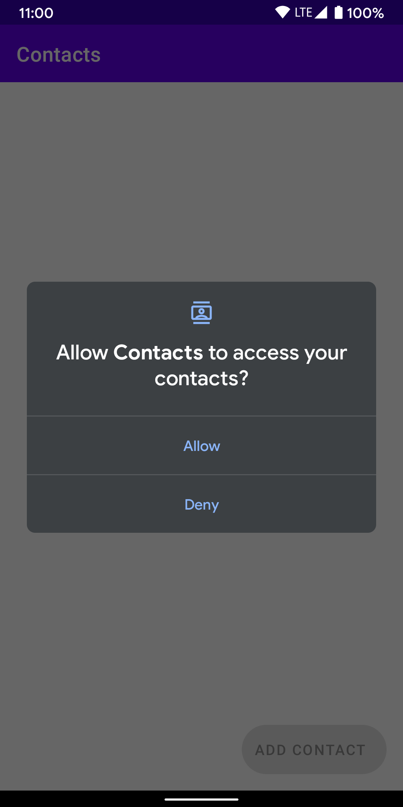
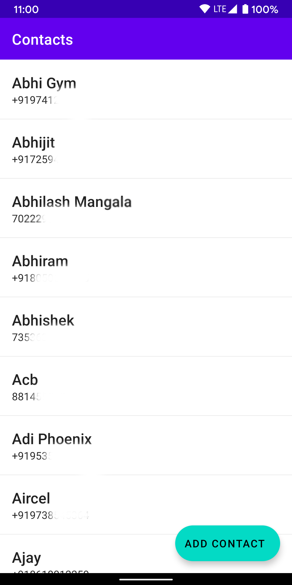
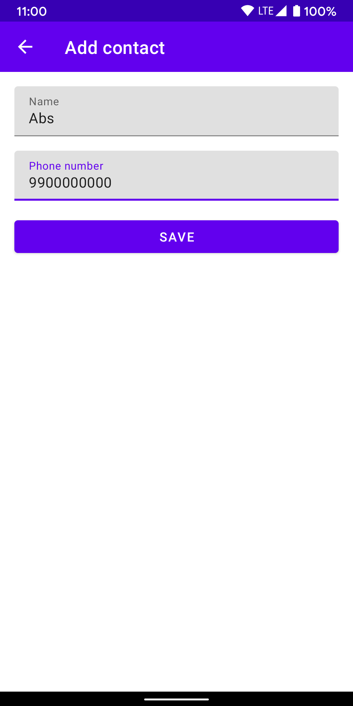
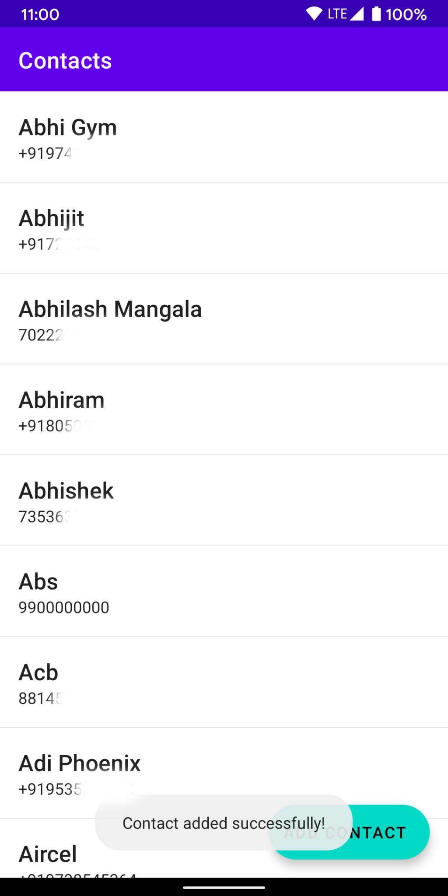

# Phone Contacts App
A simple android app which displays contacts from the phone book and also has a support to add new concact.

This sample follows MVVM Single-Activity architecture using Android Jetpack components such as - Navigation component, ViewModel, Livedata, View binding and Hilt.

## The app has following packages:
1. **views**: It contains Views(Activities and Fragments).
2. **di**: Dependency providing classes using Hilt.
3. **viewmodels**: Contains android ViewModels. They provide data to Views by interacting with repositories.
4. **utils**: Utility classes.
to5. **data**: contains *repositories* - To interact with the phone book and *models* - Kotlin data classes to hold data.

**ContactsActivity** hosts two fragments, *ListContactsFragment* and *AddContactFragment* to display and to create contacts respectively.

*ListContactsFragment* displays contacts in a *recyclerview* using ListAdapter and DiffUtil to load data efficiently.

## Screenshots:

  
  
  
  

